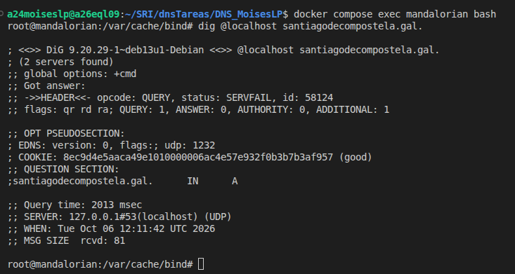

## Instalar el servidor BIND9 en el equipo `darthvader`

- comando `dig @localhost xunta.gal`

## Configurar el servidor BIND9 en el equipo `mandalorian` para que entregue como reenviador a `darthvader`

- Contenido de named.conf.options

        options {
	        directory "/var/cache/bind";
	        forwarders{
		        192.168.20.10;
	        };
        };

- comando `dig @localhost santiagodecompostela.gal.`        

## Contenido de archivo de zona de resolución directa `db.starwars.lan`

        $TTL    86400
        @       IN      SOA     darthvader.starwars.lan. moises.starwars.lan. (
                                1   ; Número de serie
                                3600        ; Actualización (Refresh)
                                1800        ; Reintento (Retry)
                                1209600     ; Caducidade (Expire)
                                86400 )     ; TTL mínimo

        @               IN      NS      darthvader.starwars.lan.
        @               IN      NS      darthsidious.starwars.lan.
        @               IN      TXT     "Que a forza te acompanhe"
        @               IN      MX      10 c3po.starwars.lan.
        @               IN      A       starwars.lan
        darthvader      IN      A       192.168.20.10
        skywalker       IN      A       192.168.20.101
        skywalker       IN      A       192.168.20.111
        luke            IN      A       192.168.20.22
        darthsidious    IN      A       192.168.20.11
        yoda            IN      A       192.168.20.24
        yoda            IN      A       192.168.20.25
        c3po            IN      A       192.168.20.26
        palpatine       IN      CNAME   darthsidious.starwars.lan.

## Contenido de archivo `/etc/bind/named.conf.local`

        zone "starwars.lan" {
                type primary;
                file "/etc/bind/db.starwars.lan";
        };

## Contenido de archivo de zona de resolución inversa `db.192`

        $TTL    604800
        @       IN      SOA     darthvader.starwars.lan. moises.starwars.lan. (
                                1   ; Número de serie
                                3600        ; Actualización (Refresh)
                                1800        ; Reintento (Retry)
                                1209600     ; Caducidade (Expire)
                                86400 )     ; TTL mínimo
        ;
        @       IN      NS      darthvader.starwars.lan.
        10      IN      PTR     darthvader.starwars.lan.
        11      IN      PTR     darthsidious.starwars.lan.
        22      IN      PTR     luke.starwars.lan.
        24      IN      PTR     yoda.starwars.lan.
        25      IN      PTR     yoda.starwars.lan.
        26      IN      PTR     c3po.starwars.lan.
        101     IN      PTR     skywalker.starwars.lan.
        111     IN      PTR     skywalker.starwars.lan.

## Contenido de archivo `/etc/bind/named.conf.local`

        zone "starwars.lan" {
                type primary;
                file "/etc/bind/db.starwars.lan";
        };

        zone "20.168.192.in-addr.arpa"{
                type primary;
                file "/etc/bind/db.192";
        };

## Resultado de los comandos:

- nslookup darthvader.starwars.lan localhost

        Server:         localhost
        Address:        127.0.0.1#53

        Name:   darthvader.starwars.lan
        Address: 192.168.20.10

- nslookup skywalker.starwars.lan localhost

        Server:         localhost
        Address:        127.0.0.1#53

        Name:   skywalker.starwars.lan
        Address: 192.168.20.111
        Name:   skywalker.starwars.lan
        Address: 192.168.20.101

- nslookup starwars.lan localhost

        ;; Got SERVFAIL reply from 127.0.0.1, trying next server
        ;; Got SERVFAIL reply from 127.0.0.1
        Server:         localhost
        Address:        127.0.0.1#53

        ** server can't find starwars.lan: SERVFAIL

- nslookup -q=mx starwars.lan localhost

        Server:         localhost
        Address:        127.0.0.1#53

        starwars.lan    mail exchanger = 10 c3po.starwars.lan.

- nslookup -q=ns starwars.lan localhost

        Server:         localhost
        Address:        127.0.0.1#53

        starwars.lan    nameserver = darthvader.starwars.lan.
        starwars.lan    nameserver = darthsidious.starwars.lan.

- nslookup -q=soa starwars.lan localhost

        Server:         localhost
        Address:        127.0.0.1#53

        starwars.lan
                origin = darthvader.starwars.lan
                mail addr = moises.starwars.lan
                serial = 1
                refresh = 3600
                retry = 1800
                expire = 1209600
                minimum = 86400

- nslookup -q=txt lenda.starwars.lan localhost
        
        Server:         localhost
        Address:        127.0.0.1#53

        lenda.starwars.lan      text = "Que a forza te acompanhe"

- nslookup 192.168.20.11 localhost

        11.20.168.192.in-addr.arpa      name = darthsidious.starwars.lan.

## Enlace de repositorio de GitHub

